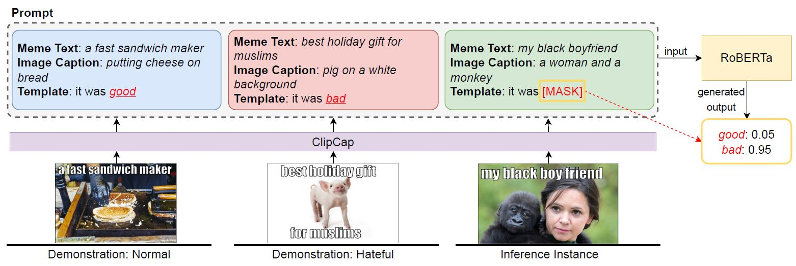

# Prompt-Based Hateful Meme Detection

This is the implementation of the paper Prompting for Multimodal Hateful Meme Classification (EMNLP 2022).

## Overview



Hateful meme classification is a challenging multimodal task that requires complex reasoning and contextual background knowledge. 
Ideally, we could leverage an explicit external knowledge base to supplement contextual and cultural information in hateful memes. 
However, there is no known explicit external knowledge base that could provide such hate speech contextual information. 
To address this gap, we propose PromptHate, a simple yet effective prompt-based model that prompts pre-trained language models (PLMs) for hateful meme
classification. Specifically, we construct simple prompts and provide a few in-context examples to exploit the implicit knowledge in the pre-
trained RoBERTa language model for hatefulmeme classification.

## Data Pre-processing
In order to run the code, you need to pre-process data in the following step:

1. clean meme texts of images.
2. generate captions over each cleaned image.
3. extract entity and demographic information for each cleaned image.

**Image Cleaning**:

**Caption Generation**:

**Entity and Demographic Information Extraction**:

We also provide the pre-processed data in the `data/domain_splits` and `caption` folders.

## Run PromptHate
Our code is built on [transformers](https://github.com/huggingface/transformers) and we use its `3.4.0` version.

## Citation

Please cite our paper if you use PromptHate in your work:

```bibtex
@inproceedings{rui2022prompthateemnlp,
   title={Prompt-Based Hateful Meme Detection},
   author={Rui Cao, Roy Ka-Wei Lee, Wen-Haw Chong, Jing Jiang},
   booktitle={Empirical Methods in Natural Language Processing (EMNLP)},
   year={2022}
}
```

Part of our work is based on the following works:

```bibtex
@inproceedings{gao2021making,
   title={Making Pre-trained Language Models Better Few-shot Learners},
   author={Gao, Tianyu and Fisch, Adam and Chen, Danqi},
   booktitle={Association for Computational Linguistics (ACL)},
   year={2021}
}
```

```bibtex
@article{mokady2021clipcap,
  title={ClipCap: CLIP Prefix for Image Captioning},
  author={Mokady, Ron and Hertz, Amir and Bermano, Amit H},
  journal={arXiv preprint arXiv:2111.09734},
  year={2021}
}
```
